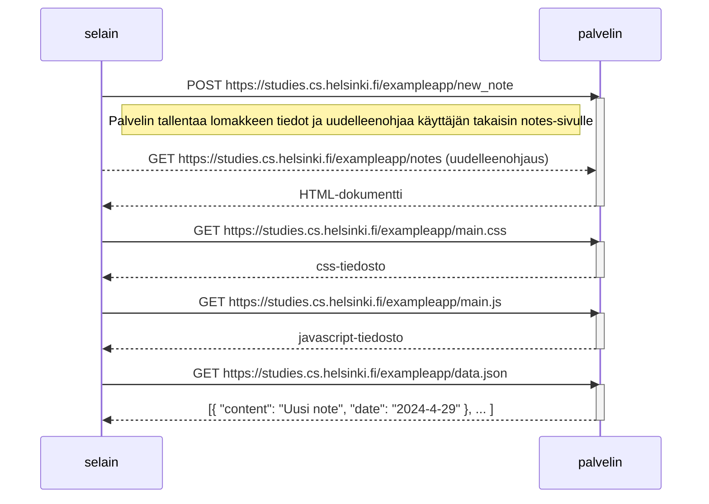

```mermaid
sequenceDiagram
    participant selain
    participant palvelin
    
 selain->> palvelin: POST https://studies.cs.helsinki.fi/exampleapp/new_note
    activate palvelin
    Note right of selain: Palvelin tallentaa lomakkeen tiedot ja uudelleenohjaa käyttäjän takaisin notes-sivulle
 selain-->> palvelin: GET https://studies.cs.helsinki.fi/exampleapp/notes (uudelleenohjaus)
 palvelin-->> selain: HTML-dokumentti
    deactivate palvelin
    
 selain->> palvelin: GET https://studies.cs.helsinki.fi/exampleapp/main.css
    activate palvelin
 palvelin-->> selain: css-tiedosto
    deactivate palvelin
    
 selain->> palvelin: GET https://studies.cs.helsinki.fi/exampleapp/main.js
    activate palvelin
 palvelin-->> selain: javascript-tiedosto
    deactivate palvelin
    

 selain->> palvelin: GET https://studies.cs.helsinki.fi/exampleapp/data.json
    activate palvelin
 palvelin-->> selain: [{ "content": "Uusi note", "date": "2024-4-29" }, ... ]
    deactivate palvelin
```