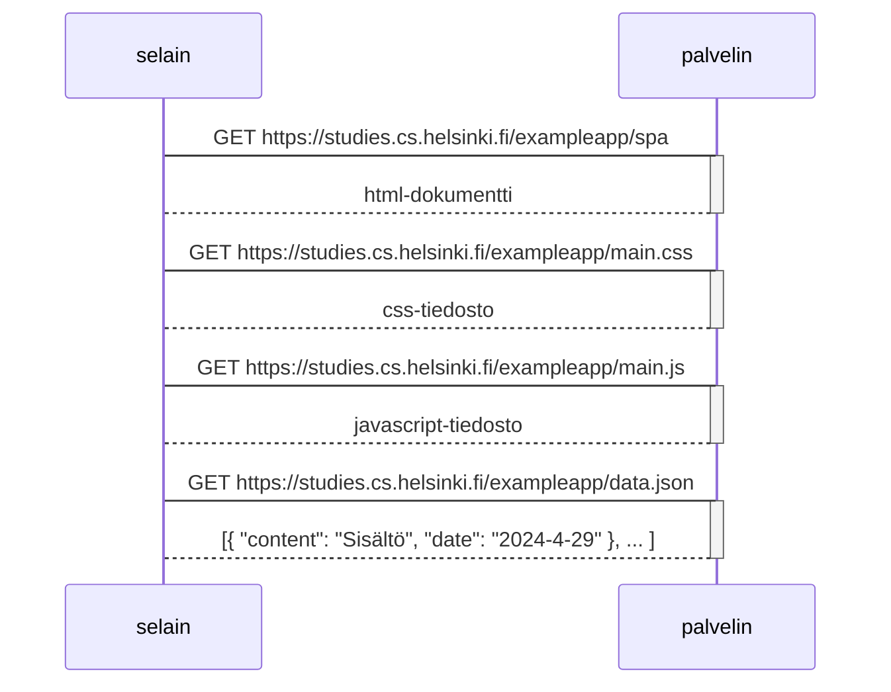

```mermaid
sequenceDiagram
    participant selain
    participant palvelin
    

 selain-> palvelin: GET https://studies.cs.helsinki.fi/exampleapp/spa
    activate palvelin
    palvelin--> selain: html-dokumentti
    deactivate palvelin
    
 selain-> palvelin: GET https://studies.cs.helsinki.fi/exampleapp/main.css
    activate palvelin
 palvelin--> selain: css-tiedosto
    deactivate palvelin
    
 selain-> palvelin: GET https://studies.cs.helsinki.fi/exampleapp/main.js
    activate palvelin
 palvelin--> selain: javascript-tiedosto
    deactivate palvelin
    
 selain-> palvelin: GET https://studies.cs.helsinki.fi/exampleapp/data.json
    activate palvelin
 palvelin--> selain: [{ "content": "Sisältö", "date": "2024-4-29" }, ... ]
    deactivate palvelin
```